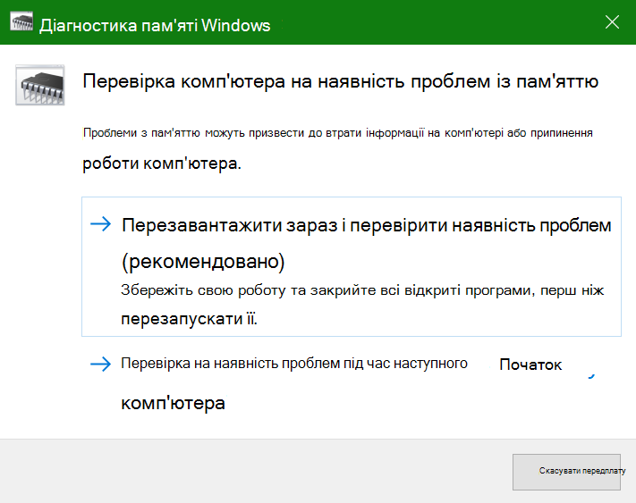

# Запуск діагностики пам'яті Windows у Windows 10

Якщо Windows і програми на ПК аварійно завершує роботу, заморозять або діють у нестабільному режимі, можливо, виникли проблеми з пам'яттю ПК (ОЗП). Можна запустити діагностику пам'яті Windows, щоб перевірити наявність проблем із оперативною пам'яттю ПК.

У полі пошуку на панелі завдань введіть **діагностику пам'яті**, а потім виберіть **діагностику пам'яті Windows**. 

Для запуску діагностики комп'ютер потрібно перезавантажити. Ви маєте можливість негайно перезавантажити комп'ютер (будь ласка, збережіть свою роботу і закрийте відкриті документи та електронну пошту першими) або заплануйте діагностику для автоматичного запуску наступного разу, коли комп'ютер перезавантажиться:

Під час перезавантаження комп'ютера **засіб діагностики пам'яті Windows** буде запущено автоматично. Стан і прогрес буде відображатися в міру виконання діагностики, і у вас є можливість скасувати діагностику, натиснувши клавішу **ESC** на клавіатурі.

Коли діагностику завершено, Windows почне нормально.
Відразу після перезавантаження, коли робочий стіл з'явиться, з'явиться сповіщення (поруч із піктограмою **центру підтримки** на панелі завдань), щоб вказати, чи були виявлені помилки в пам'яті. Наприклад,

Ось піктограма Центру підтримки:  

І приклад повідомлення: 

Якщо ви пропустили сповіщення, можна вибрати піктограму **центру підтримки** на панелі завдань, щоб відобразити **центр підтримки** та переглянути прокручуване список сповіщень.

Щоб переглянути докладні відомості, введіть **подію** в поле пошуку на панелі завдань, а потім виберіть пункт **Перегляд подій**. У лівій області **перегляду подій**перейдіть до **журналу Windows > системи**. В області праворуч виконайте пошук у списку під час перегляду **вихідної** колонки, доки не побачите події з вихідним значенням у **запам'ятовидіагностика-результати**. Виділіть кожну таку подію та перегляньте інформацію про результат у полі на вкладці **загальні** під списком.
